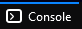
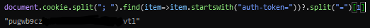

# Ky's Twitch Stream Recorder
This exe allows you to record twitch streams live to .mp4 files.
## Requirements
- Network
- PC
- Brain
- Your Love to Namin
## English installation steps
0) Install [Streamlink](https://github.com/streamlink/windows-builds/releases) in the Assets section
(The latest version is fine, then just click Next while installation)

1) Please make sure `C:\Program Files\Streamlink\ffmpeg\` has ffmpeg.exe (You got this once you installed streamlink)

2) Download My programme (I am talk shit XD)

3) Find/open a blank folder and put the program in it

4) Done and open it!

The program will first ask you if you want to choose another streamer, if you want to download Namin then just leave it blank and press Enter.

Then the program will ask you for Token. The Token is for filtering Twitch Ads

>Once you type your token, my programme will create a file called token to save your token so you don't need to type it next time. 

The program will continue to display `streamername is offine` to check if streamer has started streaming or not.

Once you see the .mp4 file in your folder which means finish downlaod. .ts file means downloading
### For the Token
1) Go to your browser and go to twitch page and press F12

2) Then go to the Console Page

3) Type: `document.cookie.split("; ").find(item=>item.startsWith("auth-token="))?.split("=")[1]` and press enter

4) It will show your token

5) Copy it into my application

> The program will continue to run 24/7 even the streamer stops broadcasting. If you do not want to occupy the network and computer performance, please close the programme.

## 中文安裝步驟
0) 安裝[Streamlink](https://github.com/streamlink/windows-builds/releases) (最新版本就好，全部按下一步就好了)

1) 請確定 `C:\Program Files\Streamlink\ffmpeg\` 有 ffmpeg.exe (正常來說安裝streamlink就會有了)

2) 下載我弄的程式 (廢話)

3) 找一個/開一個空白資料夾, 然後把我的程式放進去

4) 開起來！

該程序將首先詢問您是否要選擇另一個流媒體，如果您要下載 Namin，則將其留空並按 Enter。

然後程式會要求你提供 Token。 令牌用於過濾 Twitch 廣告

>一旦你輸入了你的Token，程序會創建一個名為 token 的文件來保存你的Token，這樣你下次就不需要再輸入了。

程式將繼續顯示`Namin is offine`以檢查金主播是否已開始直播。

金主播下播後然後等程式回到`Namin is offine`, .mp4檔會出現在你的程式的資料夾。.ts檔意味著下載中

### 拿你自己的Token
1) 在圖奇網站按 F12

2）然後轉到console頁面

3) 輸入：`document.cookie.split("; ").find(item=>item.startsWith("auth-token="))?.split("=")[1]` 然後按Enter

4）它將顯示您的Token

5）將其複製到我的程式中

> 當金主播下播後程式會繼續運行24/7，如果不想佔用網絡跟電腦性能請關閉程式

## Changed
- Only Windows OS
- No Log file
- Refresh time around a second
- Date + time as file name
- Fixed shell error
- Namin1004 as main target streammer
- Enable low-latency
- No longer record when hosing
- Retry set to 1 
- Ffmpeg process will not affect streamlink process
- Applied Token function for block Twitch ads with Twitch authentication 
- Delete args in main() for exe purpose only
- Checking method change to Streamlink rather than using Twitch API
- Can customize your other streamer

If there any bugs, please find me Ky1ez#5989 through the Discord 

